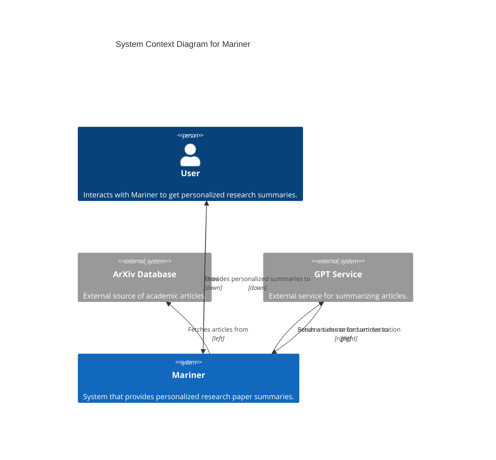
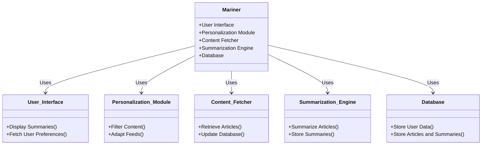
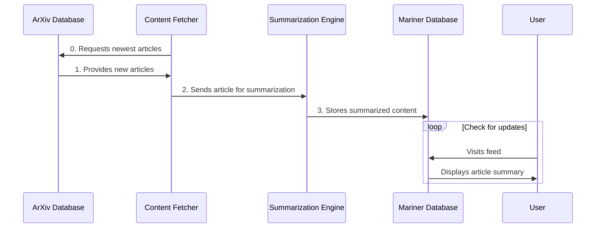
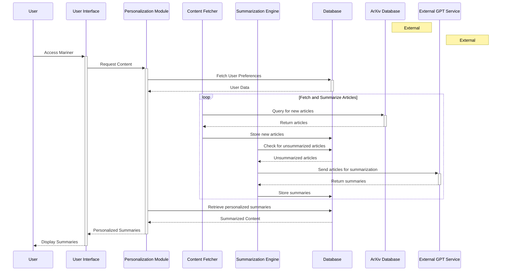
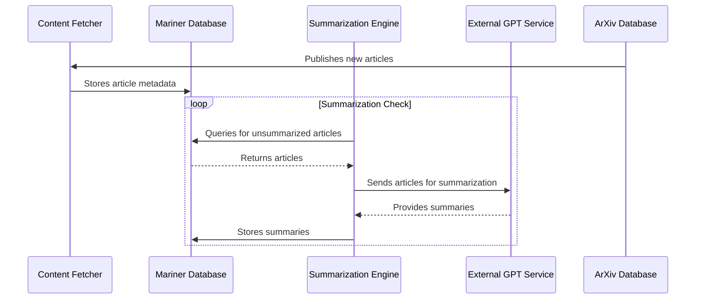

# Mariner Design Document

1. [Overview](#overview)
2. [System Architecture](#system-architecture)
3. [Data Design](#data-design)
4. [Testing](#testing)
5. [Monitoring](#monitoring)
6. [Security](#security)

## Overview

Mariner is an innovative system designed to navigate the vast ocean of academic research and intellectual currents. By leveraging advanced data processing and machine learning techniques, Mariner aims to curate, summarize, and present the most relevant and impactful research findings across a multitude of disciplines. This system acts as a bridge between the expansive world of academic research and the targeted needs of its users, providing streamlined access to knowledge and insights.

### Purpose

The purpose of Mariner is to democratize access to the latest research and foster a deeper understanding of emerging trends in technology, science, and society. It seeks to empower users, from industry professionals to academic researchers, with the ability to quickly grasp complex topics and discover interdisciplinary connections that spark innovative ideas and solutions.

### Goals

- **Content Curation**: To automatically fetch and categorize the latest research papers from diverse fields, ensuring a broad yet relevant selection of content.
- **Intelligent Summarization**: To employ natural language processing (NLP) and machine learning (ML) algorithms to generate concise, accurate summaries of research papers, highlighting key findings and implications.
- **Personalization**: To tailor content delivery based on individual user interests and behaviors, ensuring high relevance and engagement.
- **Usability**: To provide a user-friendly interface that simplifies the exploration of academic research, enabling users to efficiently find and digest information.
- **Community Building**: To create a platform that not only informs but also connects users, fostering a community of curious minds and visionary thinkers.

### Scope

Mariner will initially focus on sourcing content from high-impact academic journals and repositories, particularly those covering technology, science, and societal trends. The system will:

- Incorporate a broad range of research areas to ensure a multidisciplinary approach.
- Use robust algorithms to analyze and summarize texts, ensuring relevance and accuracy.
- Feature a dynamic, adaptive user interface that caters to individual preferences and learning goals.

The design and development of Mariner will prioritize scalability and adaptability, allowing for future expansion into additional research domains and integration with other knowledge platforms and tools.

## System Architecture

### System Context

TODO: (incorrect markup, but this idea) Directional modifiers like "down", "left", and "right" are used in the Rel commands to guide the arrows’ paths, helping to separate the entities and make the diagram clearer.
By arranging external systems on either side of Mariner (arXiv to the left and GPT Service to the right), the diagram can visually represent the flow of data in a more organized manner.

### Components

### Sequence Diagram

In this sequence:

1. The **ArXiv Database** provides a new article to the **Content Fetcher**.
2. The **Content Fetcher** sends the article to the **Summarization Engine** for processing.
3. The **Summarization Engine** creates a summary of the article and stores it in the **Mariner Database**.
4. The **User** visits their feed, which triggers the **Mariner Database** to display the latest article summary.

1. **User Accesses Mariner**: The user initiates the process by accessing the Mariner User Interface (UI).
2. **UI Requests Content**: The UI requests personalized content for the user from the Personalization Module.

3. **Personalization Module Fetches User Preferences**: The Personalization Module queries the Mariner Database to fetch the user's preferences and interaction history.

4. **Database Returns User Data**: The Mariner Database returns the relevant user data to the Personalization Module.

5. **Content Fetcher Queries ArXiv for New Articles**: Periodically, the Content Fetcher queries the ArXiv Database to check for new research articles.

6. **ArXiv Returns Articles**: The ArXiv Database provides the latest articles to the Content Fetcher.

7. **Fetcher Stores New Articles in Database**: The Content Fetcher stores the new articles in the Mariner Database for later processing.

8. **Summarization Engine Checks for Unsummarized Articles**: The Summarization Engine queries the Mariner Database to identify articles that have not yet been summarized.

9. **Database Provides Unsummarized Articles**: The Mariner Database returns the list of unsummarized articles to the Summarization Engine.

10. **Summarization Engine Sends Articles to External GPT Service**: The Summarization Engine sends these articles to an External GPT Service for summarization.

11. **GPT Service Returns Summaries**: The External GPT Service processes the articles and returns their summaries to the Summarization Engine.

12. **Summarizer Stores Summaries in Database**: The Summarization Engine stores the generated summaries in the Mariner Database.

13. **Personalization Module Retrieves Personalized Summaries**: The Personalization Module then retrieves personalized summaries based on the user's preferences and history from the Mariner Database.

14. **Database Provides Summarized Content**: The Mariner Database sends the personalized summaries back to the Personalization Module.

15. **Personalization Module Provides Summaries to UI**: The Personalization Module sends these summaries to the User Interface.

16. **UI Displays Summaries to User**: Finally, the User Interface displays the research summaries to the user, completing the process.

## Data Design

Given your requirements and the system flow described, here's a simple yet extensible data design that could be implemented in MongoDB, which is well-suited for handling varied and evolving data structures like this.

### Data Model Design

#### 1. Articles Collection

- **\_id**: MongoDB provided unique identifier (can be used as the arXiv ID).
- **title**: String
- **authors**: Array of strings
- **abstract**: String
- **topics**: Array of strings
- **url**: String (URL to the arXiv entry)
- **submittedDate**: Date
- **status**: String (e.g., "RETRIEVED", "SUMMARIZED")
- **statusDate**: Date (date when the status was last updated)
- **summaries**: Array of objects containing:
  - **userId**: String or ObjectId (to link to a User collection)
  - **summaryText**: String
  - **relevanceScore**: Number
  - **interests**: Array of strings (topics or interests this summary caters to)

#### 2. Users Collection

- **\_id**: MongoDB provided unique identifier
- **name**: String
- **email**: String
- **interests**: Array of strings
- **actions**: Array of objects containing:
  - **articleId**: ObjectId (reference to Articles collection)
  - **action**: String (e.g., "FAVORITE", "ARCHIVE", "REMOVE")
  - **actionDate**: Date

### System Flow Integration

- When new papers are fetched from arXiv, they are added to the Articles collection with the status "RETRIEVED". The statusDate is set to the current date.
- Another process updates the status to "SUMMARIZED" after generating the summary, also updating the statusDate to reflect this change.
- Users can view, favorite, archive, or remove articles through the interface, which updates their actions in the Users collection.

### Design Justification and Extension

- **Scalability**: MongoDB’s flexible schema allows for easy addition of new fields or changes to existing structures, facilitating future expansions.
- **Performance**: By storing summaries within the Articles collection, you minimize the need for extensive joins or lookups, which suits MongoDB's document-oriented nature.
- **User-Specific Relevance**: Storing a relevance score and interests per summary allows for personalized content filtering without complex query logic.
- **Status Tracking**: The status and statusDate fields help track the lifecycle of an article's processing and identify bottlenecks or issues in the workflow.
- **User Actions**: Keeping user actions linked with articles in the Users collection simplifies user-specific operations and preferences management.

### Potential Extensions

- As the user base grows, you might want to introduce indexing on frequently queried fields (e.g., status, topics, userId, articleId) to enhance performance.
- For handling more complex workflows or a significant increase in data volume, consider introducing message queuing or stream processing systems for better load management and real-time processing capabilities.

This design provides a solid foundation that meets your current requirements while offering flexibility for future enhancements and scalability.

In the system described, the following queries are likely to be involved, categorized by their expected frequency of use and strategies for optimization.

### Most Frequent Queries

1. **Retrieving new entries for processing**

   - Query to find articles with a status of "RETRIEVED".
   - Used frequently as part of the automated process to update the status to "SUMMARIZED" after processing.
   - **Optimization**: Index on `status` to speed up retrieval of articles awaiting processing.

2. **Summarizing articles**

   - Query to fetch the full text of articles for summarization.
   - Runs frequently as part of the summary generation process.
   - **Optimization**: Since this will likely fetch the entire document, ensure efficient retrieval by having a good storage setup and potentially caching mechanisms for frequently accessed data.

3. **User-specific article retrieval**
   - Query to display articles and summaries based on user interests and actions (favorites, archives, removals).
   - Highly frequent as users interact with the system to read summaries.
   - **Optimization**: Index on `summaries.userId` and `actions.articleId` to quickly fetch articles related to a specific user. Consider also indexing `interests` if filtering by user interest is common.

### Occasionally Used Queries

1. **Status update for articles**

   - Updating the `status` and `statusDate` of an article after it has been processed.
   - Occurs less frequently, corresponding to the rate of article processing and summarization.
   - **Optimization**: While not accessed as often, ensuring the `status` field is indexed supports quick updates.

2. **User action updates (favorite, archive, remove)**
   - Inserting or updating user actions related to articles.
   - Occurs as users interact with the system, but less frequently than viewing articles.
   - **Optimization**: Using an array of actions within the Users collection can minimize the complexity of these queries. Indexing on `actions.articleId` can speed up updates and retrievals of user actions.

### Rare Queries

1. **Periodic maintenance tasks**
   - Queries for system maintenance, such as cleaning up old data or analyzing usage patterns.
   - Very infrequent, potentially running as background tasks during off-peak hours.
   - **Optimization**: These tasks usually don’t require immediate execution, so they can be scheduled during low-load periods to minimize impact on system performance.

### Optimization Strategies

- **Indexing**: Create indexes on the most frequently queried fields to reduce lookup times. This is crucial for fields like `status`, `userId`, and `articleId`.
- **Balanced Schema Design**: While MongoDB is schema-less, designing a balanced document structure that minimizes unnecessary data duplication can improve performance.
- **Caching**: Implement caching for frequently accessed data, especially for articles that are viewed and summarized repeatedly.
- **Background Processing**: Schedule maintenance and low-priority tasks during off-peak hours to avoid impacting system performance during high-usage periods.

By prioritizing these optimizations, the system can handle frequent operations efficiently while retaining the flexibility to accommodate future extensions and increased workload.

## Testing

### Unit Testing

For unit testing in Ruby, the most common framework is RSpec. It provides a rich and flexible toolset for testing Ruby applications and is well-suited for behavior-driven development (BDD).

- **Code Coverage**: While 100% code coverage is ideal, it might not always be practical, especially for areas heavily interfacing with external services or the database. Aim for a code coverage target of around 80-90%, prioritizing critical paths and business logic. Tools like SimpleCov can be used with RSpec to track code coverage.
- **Mocking and Stubbing**: Given Mariner’s reliance on external services, use mocking and stubbing to simulate external API calls within unit tests. This approach ensures tests remain fast and reliable without depending on external systems.

### Integration Testing

Integration tests should focus on workflows that are critical to Mariner’s operation, specifically the interaction between components and with external systems:

- **Summarization Workflow**: Test the entire process from fetching articles from the ArXiv database, summarizing them with the GPT service, and storing the results in the Mariner Database.
- **User Interaction Workflow**: Test how the system handles user interactions, such as fetching personalized content, updating preferences, and displaying summaries.
- **Database Integration**: Ensure that the application correctly interacts with MongoDB, including reading and writing data, and handling database errors gracefully.

For integration testing, tools like Capybara can be used alongside RSpec in Ruby, providing a way to simulate user interactions and test the integration of various system components.

### CI/CD and Deployment Testing

For continuous integration and deployment (CI/CD), a suite of tests should be in place to ensure that new changes don't break existing functionality and that the code is always production-ready:

- **Automated Test Suite**: Configure a CI tool (like Jenkins, GitHub Actions, or GitLab CI) to run the full suite of unit and integration tests on every commit or pull request. This setup helps in identifying issues early in the development cycle.
- **Deployment Pipeline Tests**: Include tests in the deployment pipeline to verify that the application can be successfully deployed to a staging or production environment. This might include smoke tests to quickly check the health and basic functionality of the deployed application.
- **Performance and Load Testing**: Consider incorporating basic performance and load testing in the CI/CD pipeline, especially for critical paths that could be impacted by scalability issues.

### Best Practices

- **Test Automation**: Automate as much of the testing process as possible to reduce manual effort and increase reliability.
- **Continuous Testing**: Integrate testing into the continuous integration process to ensure that issues are detected and addressed promptly.
- **Quality Gates**: Establish quality gates in the CI/CD pipeline, such as code coverage thresholds or mandatory code review approvals, to ensure that only high-quality code is deployed to production.

By adhering to these testing practices, Mariner can maintain high standards of quality and reliability, facilitating a smooth and efficient development lifecycle.

## Monitoring

### Overview

Effective monitoring and alerting are crucial for maintaining the reliability and performance of Mariner. Given the application's architecture, including a Ruby on Rails web application, a MongoDB database, and interactions with external systems, we need to establish a basic monitoring setup that can be expanded in the future.

### Key Components to Monitor

#### 1. **Application Performance (Rails)**

- **Response Times**: Monitor the average time it takes for the application to respond to requests, which can help identify performance degradations.
- **Error Rates**: Track the frequency of application errors or exceptions to catch and address issues promptly.
- **Request Throughput**: Measure the number of requests handled by the application over time to understand traffic patterns and potential stress points.

#### 2. **Database Performance (MongoDB)**

- **Query Performance**: Monitor the execution time of database queries to identify slow queries that may need optimization.
- **Connection Counts**: Keep track of the number of active connections to the database to prevent connection overflows.
- **Resource Utilization**: Monitor the database server's CPU, memory, and disk usage to detect potential bottlenecks or resource constraints.

#### 3. **External Systems Interactions**

- **API Response Times**: Track the response times of external systems (ArXiv and GPT Service) to detect latency issues or unavailability.
- **API Error Rates**: Monitor the error rates of API calls to external services to quickly identify integration issues or service disruptions.

### Alerting

Initially, setting up a simple status page that provides real-time visibility into the system's health and performance metrics can be sufficient. This page should display the status of key components and any notable issues detected by the monitoring system.

For future-proofing the monitoring and alerting setup, consider using tools that allow for easy escalation. For example, if a critical performance metric exceeds a certain threshold, the system should support triggering alerts through emails or push notifications.

## Security

Security is a critical component of the Mariner system. Given its architecture, including the use of Ruby on Rails, MongoDB, and interactions with external systems, the following security measures should be implemented:

### 1. **Application Security**

- **Authentication and Authorization**: Implement strong authentication mechanisms to control access to the Mariner system. Use role-based access control (RBAC) to manage what authenticated users can see and do within the application.
- **Input Validation**: Protect against common web vulnerabilities like SQL injection (even though MongoDB is NoSQL, injection attacks can still occur) and cross-site scripting (XSS) by validating, sanitizing, and escaping user inputs.
- **Secure Communication**: Ensure that all data transmitted between the client and server is encrypted using HTTPS to prevent eavesdropping and man-in-the-middle attacks.

### 2. **Database Security**

- **Access Controls**: Restrict database access to only the Mariner application and authorized personnel. Use MongoDB’s built-in roles to limit access based on the principle of least privilege.
- **Data Encryption**: Use encryption at rest to protect stored data, and encryption in transit to secure data being transferred to and from the database.
- **Regular Audits**: Perform regular audits of database access and activities to detect and respond to unauthorized access or anomalies.

### 3. **External Systems Security**

- **API Security**: Secure communication with external APIs (like ArXiv and GPT Service) using API keys or OAuth tokens. Ensure that these keys are kept secure and have limited permissions to minimize potential damage if compromised.
- **Service Monitoring**: Regularly monitor the availability and integrity of external services to quickly detect and respond to outages or changes that could impact Mariner.

### 4. **Secrets Management**

- **Environment Variables**: While using `.env` files and environment variables is a good practice, ensure that `.env` files are not committed to version control systems by including them in `.gitignore`.
- **Secure Storage**: Use secrets management tools (like HashiCorp Vault, AWS Secrets Manager, or environment-specific secrets management in hosting platforms) to securely store and access secrets like API keys, database credentials, and other sensitive configuration details.
- **Access Controls**: Limit access to environment variables and configuration files to only parts of the system and personnel that need them.

### 5. **Security Best Practices**

- **Code Reviews and Audits**: Conduct regular code reviews and security audits to identify and remediate security vulnerabilities.
- **Security Training**: Ensure that the development and operations teams are trained in security best practices and are aware of common security threats.
- **Patch Management**: Keep all parts of the system, including the Rails framework, MongoDB, and any third-party libraries, up to date with the latest security patches.

By integrating these security measures into the design and development of Mariner, the system can protect against common security threats and vulnerabilities, ensuring the integrity, confidentiality, and availability of the system and its data.
