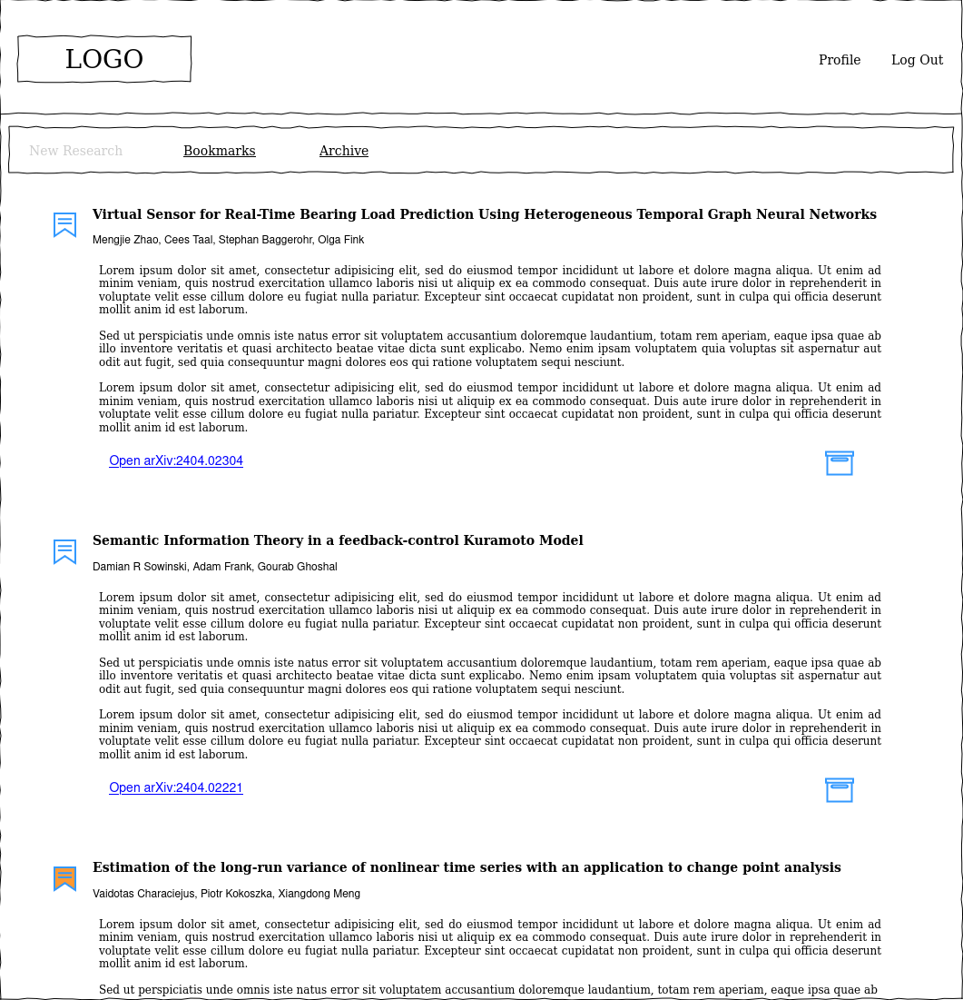
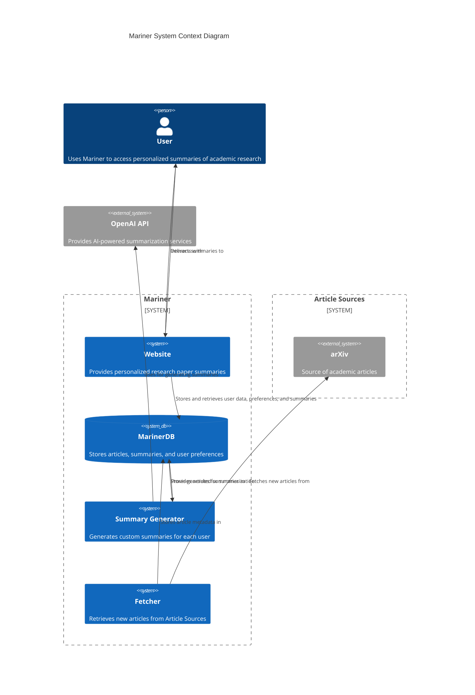
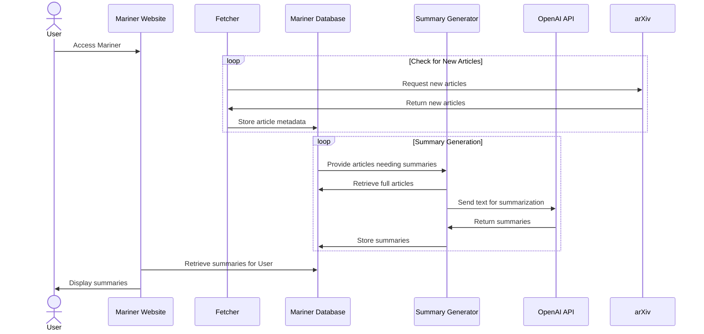

# Mariner Design Document

1. [Overview](#overview)
1. [UI](#ui)
1. [System Design](#system-design)
1. [Data Design](#data-design)
1. [Testing](#testing)
1. [Monitoring](#monitoring)
1. [Security](#security)

## Overview

Mariner is designed to transform the way academic research is consumed by making it accessible and relevant to a broader audience. By providing clear, concise summaries of academic papers, Mariner eliminates the barrier of complex jargon and dense mathematical proofs, allowing users to stay abreast of the latest scientific breakthroughs tailored to their interests. This platform is not just for those unaccustomed to reading scholarly articles but also serves as a time-saving tool for seasoned academics who wish to quickly scan the latest research before delving into full papers for detailed study.

At its core, Mariner's mission is to democratize access to cutting-edge research and encourage a deeper understanding of the evolving trends across various disciplines. It achieves this through smart content curation, personalization, and a user-centric interface, making it possible for users to explore outside their expertise and connect disparate ideas, thus fostering creativity and innovation. Whether for a quick update on recent studies or exploring new interdisciplinary insights, Mariner is tailored to enhance discovery and learning in the ever-expanding universe of academic knowledge.

### Scope

The scope of Mariner is focused on delivering a personalized academic digest only from the arXiv repository. In its initial version, Mariner will cater to individual users by offering a tailored feed of research articles, where each user can bookmark or archive articles in their feed. The platform will present articles chronologically based on their publication date, supplemented with a customized summary and a link to the full text on the arXiv site.

- Mariner will initially aggregate content exclusively from arXiv, so users won't have access to papers from other academic journals or repositories.
- Users can select their interests from a predefined list, and these choices will dictate the content of the summaries they receive. The system lacks the capability for users to finely tune or define the nuances of their interest areas beyond this selection.
- Summaries generated by an LLM (Large Language Models) may not capture every detail accurately. For critical or detailed information, users are encouraged to consult the original papers.
- Once a user adjusts their interest preferences, only new articles added to the system will reflect these changes. Previously summarized articles in their feed will not be updated to align with new interests.
- Mariner does not provide a feature to directly share summaries or articles on social media platforms; users will need to manually post about articles if they wish to share them.

### Priorities

Use these to make decisions about trade-offs.

1. **Automation** The system should require minimal attention after initial development is complete
1. **Reliability** Things should work as promised, and the system should be able to quickly recover from any errors or outages
1. **Extensibility** The system should accommodate future features, data sources, use cases
1. **Simplicity** Use as little code as possible for the logic, limit options and customizations

### Key Use Cases

- As a user, I want to quickly review recently published articles, so I can keep up with new research that is coming out.
- As a user, I want to bookmark articles of interest, so that I can easily find and read them later in detail.
- As a user, I want to archive articles I'm not interested in, so that they no longer clutter my feed and I can focus on more relevant content.
- As a user, I want to adjust my interest areas, so that the summaries in my feed reflect my changing research interests and needs.
- As a system administrator, I want to monitor the system's health and performance, so that I can ensure it operates efficiently and effectively.
- As a content manager, I want to manage the list of interest areas, so that the system remains relevant and up-to-date with current research trends.
- As a system administrator, I want to manage user accounts, so that I can ensure only authorized users access the system and maintain data privacy and security.

## UI

The user's main page is a list of research articles, called the Review section. For each article, they see the title, authors, and a link to the source article (e.g. the entry on arXiv's website). There is a customized summary that highlights things the user might be interested in. The user might click on the link and read the full paper if they are interested. The user might also click the bookmark icon, so they can quickly find this article later. Most of the time, the user will click the archive icon, because the summary is enough for them to be aware.

Bookmarking an article flags it, but it stays where it is. Archiving an article moves it from the review feed to the Archived section. Users can view all bookmarked articles in the Bookmarked section.

## System Design

### System Context

- **User and Mariner**: Users interact with Mariner to view personalized summaries of academic research. They can bookmark articles of interest or archive those they are done reviewing.
- **Mariner and MarinerDB**: Mariner stores user data, preferences, and generated summaries in MarinerDB. It also retrieves this information to present personalized content to users.
- **Fetcher and arXiv**: The Fetcher component retrieves new articles from arXiv. It is designed to handle the high volume of articles published monthly, ensuring Mariner remains up-to-date with current research.
- **Fetcher and MarinerDB**: After fetching, Fetcher stores the article metadata, including Article ID, Title, Authors, Subject, Source URL, and Content URL, in MarinerDB.
- **Summary Generator and MarinerDB**: The Summary Generator queries MarinerDB to find articles that need summarizing. It ensures that each user gets custom summaries based on their interests.
- **Summary Generator and OpenAI API**: Utilizing the OpenAI API, the Summary Generator creates personalized summaries for the articles. This process involves downloading the article's content, summarizing it, and then deleting the downloaded files to manage storage efficiently.
- **MarinerDB and Summary Generator**: MarinerDB provides articles to the Summary Generator for summarization, ensuring that only new and relevant articles are processed for each user.
- **Mariner and User**: Finally, Mariner delivers these summaries to the user, maintaining a feed that is relevant, up-to-date, and tailored to the user's specified interests.

In Mariner, aggressive removal of archived summaries and limiting the user's review feed to the most recent articles help manage storage and ensure users are presented with the most relevant and current research, aligning with Mariner’s goals of providing timely and pertinent academic insights.

### Sequence Diagram

- **User Interaction**: The user accesses the Mariner Website to view summaries or manage their interests.
- **Fetching New Articles**: The Fetcher periodically requests new articles from arXiv, which are then returned and stored in the Mariner Database.
- **Summary Generation**:
  - The Mariner Database provides articles that need summarizing to the Summary Generator.
  - The Summary Generator retrieves the full text of these articles from the Mariner Database.
  - It then sends this text to the OpenAI API for summarization.
  - The OpenAI API processes the text and returns the summaries to the Summary Generator.
  - The Summary Generator saves these summaries in the Mariner Database.
- **Display Summaries**: Finally, the Mariner Website retrieves the summaries from the Mariner Database and displays them to the user.

This sequence diagram provides a clear step-by-step visualization of how new articles are ingested and processed to generate summaries in the Mariner system, highlighting the interaction between different components of the system and external services.

### Front End Implementation

React.js is selected for the Mariner front end, leveraging its component-based structure to efficiently handle dynamic updates, such as real-time summary modifications. This choice supports streamlined development and future maintenance, reducing the need for ongoing adjustments and aligning with the goal of automation.

The multi-page architecture, as opposed to a single-page application, enhances initial load performance and system stability, ensuring reliability for end-users. Each section, like the review feed and bookmarked articles, is managed separately, facilitating quicker recovery from disruptions and contributing to overall system resilience.

This approach also allows for clear scalability and the integration of new functionalities, addressing the extensibility priority. As Mariner evolves, new sections or features can be added with minimal disruption to the existing infrastructure.

By adopting React.js and avoiding the complexities of SPA architecture, Mariner maintains simplicity in its front-end design. This ensures that the UI remains straightforward to update and manage, resonating with the simplicity priority by minimizing unnecessary code and focusing on core functionalities.

### Back End Implementation

Ruby on Rails is the chosen framework for Mariner's back end, capitalizing on its comprehensive set of features that streamline web application development. This choice supports a streamlined initial setup and future maintenance efficiency, fitting well with the need for a system that automates complex processes seamlessly. The framework's robustness and proven track record ensure the back end's reliability, particularly important as Mariner evolves and scales.

Mariner will operate as a monolith, simplifying development and reducing the complexities of deployment and operation. This single-instance model is sufficient for the expected user load during the closed beta and simplifies the transition to a load-balanced architecture when user demand increases. Such a setup allows for straightforward scalability and system enhancement without immediate architectural overhauls.

ArxivFetcher and Summary Generator will be integrated as background services within the Rails application, sharing models, logic, and configurations to promote code reuse and maintain consistency. ArxivFetcher will be scheduled as a cron job to run daily, ensuring up-to-date article retrieval without manual intervention. Summary Generator, designed for parallel processing, will be triggered periodically to manage workload efficiently, preparing for potential future scaling.

By embedding these components within the Rails ecosystem, Mariner benefits from a cohesive, manageable codebase that adheres to a unified deployment strategy. This approach allows for distinct, scalable operations of each component, aligning with Mariner’s growth and expansion goals, and laying a foundation for a robust, user-centric service.

### Database

Mariner uses MongoDB. A document database's flexible schema accommodates the varying structures of the content and user data. This adaptability is crucial for Mariner's evolving needs, allowing for straightforward updates to the database schema without significant overhauls. MongoDB's performance with large datasets ensures that Mariner can handle the growing volume of articles and user interactions efficiently.

While initially deployed as a single instance, With MongoDB's potential for redundancy and scaling, Mariner has a robust foundation for feature expansions and user growth.

## Data Design

### Queries

- **Check Article Processing Status**: This query is critical to ensure that each article is only processed once for summarization, preventing duplicate efforts by different Summary Generator instances. It checks the article's current status before processing and retrieves a single record, requiring fast and indexed access to the `Article ID`.

- **Add New Article Metadata**: After fetching new articles from arXiv, the system stores their metadata. This operation, which inserts multiple records per batch, is vital for keeping the database current and ready for summarization processes.

- **Retrieve Article for Summarization**: Regularly, the system selects the next article to summarize, ensuring that no article is processed more than once, even when multiple Summary Generator instances are active. This step is crucial for maintaining an efficient and non-redundant summarization workflow.

- **Insert Custom Summary**: Post-summarization, each custom summary is added to the user’s feed, involving a single record insertion for each user-article pair. This process highlights the importance of quick database operations and the need for effective indexing on `User ID` and `Article ID`.

- **Retrieve User Review Feed**: Frequently accessed, this query populates the user's review feed with the latest summaries. It is optimized to return the most recent articles, using pagination to manage the data volume and enhance the user experience.

- **Bookmark an Article**: Users regularly bookmark articles, necessitating a system that can quickly update the bookmark status in the user’s profile. This operation requires efficient database access to update single records promptly.

- **Archive an Article**: Similar to bookmarking, archiving is a common user action that removes articles from the active feed. The system needs to quickly update the archive status for each article, ensuring a seamless user experience.

- **Load Bookmarked Articles**: This query retrieves all articles bookmarked by the user, which, while less frequent than feed loading, is essential for a positive user experience. The system must efficiently handle potentially large datasets of bookmarked content.

- **Load Archived Articles**: Accessing archived articles is less frequent but can involve a significant number of records. Efficient data retrieval mechanisms are necessary to manage the potentially extensive archive without compromising performance.

### Data Lifecycle Management

In Mariner, the management of data, specifically summary documents, is designed to optimize storage use and ensure content relevance through a well-defined lifecycle. Summaries are initially set to expire 8 days after creation, providing users with sufficient time to review the latest research findings. If a user archives a summary, indicating lesser immediate value, its expiration is shortened to 3 hours, preparing it for automatic deletion unless reconsidered within that timeframe. Conversely, summaries returned to the review feed are reassigned the 8-day expiration period, reflecting their restored significance. Bookmarked summaries, valued for long-term reference, are exempt from automatic expiration, remaining indefinitely in the system.

### Collections

1. **Articles Collection** Stores metadata for each article fetched from the Article Sources.

   - `_id`: MongoDB's default unique identifier (Indexed).
   - `title`: String
   - `authors`: Array of strings
   - `subject`: String
   - `publicationDate`: Date (Indexed)
   - `sourceURL`: String
   - `contentURL`: String
   - `status`: String (`pending`, `summarized`) (Indexed)

2. **Summaries Collection** Stores user-specific summaries.

   - `_id`: MongoDB's default unique identifier (Indexed).
   - `articleMetadata`: Object
   - `title`: String
   - `authors`: Array of strings
   - `subject`: String
   - `publicationDate`: Date
   - `sourceURL`: String
   - `contentURL`: String
   - `userId`: ObjectId (Indexed)
   - `text`: String
   - `createdDate`: Date (Indexed)
   - `status`: String (`in_review`, `archived`) (Indexed)
   - `isBookmarked`: Boolean (Indexed)
   - `expirationDate`: Date (TTL Index)

TTL Index: Set on the expirationDate field to automatically remove summaries after their relevant period (8 days for regular summaries and 3 hours for archived ones) unless marked as bookmarked.

3. **Users Collection** Manages user data.
   - `_id`: MongoDB's default unique identifier (Indexed).
   - `username`: String (Indexed)
   - `email`: String
   - `interests`: Array of strings

## Testing

### Unit Testing

In Mariner, unit testing is conducted using RSpec to ensure code quality and functionality, with a target of achieving at least 80% test coverage. This approach guarantees that a significant portion of the codebase is verified for correctness. Adherence to coding standards is enforced through RuboCop, ensuring that all code follows established best practices and style guidelines. This systematic testing strategy is essential for maintaining a high-quality, reliable codebase as Mariner evolves.

### Deployment Testing

For deployment, a series of integration tests using Rails System Tests are defined to verify the system’s end-to-end functionality and interaction with external services:

1. **Article Fetching Workflow**: Tests ensure that the Fetcher accurately retrieves and stores new articles from arXiv, effectively handling duplicates.

2. **Article Summarization Process**: These tests validate the Summary Generator's ability to correctly process articles, generate summaries via the OpenAI API, and store the results appropriately.

3. **User Review Feed Display**: Testing confirms the website’s capability to fetch and display the latest summaries, implementing efficient pagination.

4. **Bookmarking and Archiving Articles**: Functionality tests for bookmarking and archiving verify that these user actions are correctly reflected in the database and influence the feed visibility.

5. **Retrieval of Bookmarked and Archived Articles**: Ensures that users can reliably access their bookmarked and archived articles, with the system presenting the correct data.

6. **Interest Area Filtering**: Tests check that summaries are accurately filtered and presented based on the user’s selected interest areas, ensuring personalized content delivery.

7. **Concurrency and Locking in Summary Generation**: Validates that multiple instances of the Summary Generator can operate concurrently without processing conflicts or generating duplicate summaries.

## Monitoring

### Overview

Effective monitoring and alerting are crucial for maintaining the reliability and performance of Mariner. Given the application's architecture, including a Ruby on Rails web application, a MongoDB database, and interactions with external systems, we need to establish a basic monitoring setup that can be expanded in the future.

### Key Components to Monitor

#### 1. **Application Performance (Rails)**

- **Response Times**: Monitor the average time it takes for the application to respond to requests, which can help identify performance degradations.
- **Error Rates**: Track the frequency of application errors or exceptions to catch and address issues promptly.
- **Request Throughput**: Measure the number of requests handled by the application over time to understand traffic patterns and potential stress points.

#### 2. **Database Performance (MongoDB)**

- **Query Performance**: Monitor the execution time of database queries to identify slow queries that may need optimization.
- **Connection Counts**: Keep track of the number of active connections to the database to prevent connection overflows.
- **Resource Utilization**: Monitor the database server's CPU, memory, and disk usage to detect potential bottlenecks or resource constraints.

#### 3. **External Systems Interactions**

- **API Response Times**: Track the response times of external systems (ArXiv and GPT Service) to detect latency issues or unavailability.
- **API Error Rates**: Monitor the error rates of API calls to external services to quickly identify integration issues or service disruptions.

### Alerting

Initially, setting up a simple status page that provides real-time visibility into the system's health and performance metrics can be sufficient. This page should display the status of key components and any notable issues detected by the monitoring system.

For future-proofing the monitoring and alerting setup, consider using tools that allow for easy escalation. For example, if a critical performance metric exceeds a certain threshold, the system should support triggering alerts through emails or push notifications.

## Security

TODO: review OWASP top 10

### Secrets Management

- **Environment Variables**: While using `.env` files and environment variables is a good practice, ensure that `.env` files are not committed to version control systems by including them in `.gitignore`.
- **Secure Storage**: Use secrets management tools (like HashiCorp Vault, AWS Secrets Manager, or environment-specific secrets management in hosting platforms) to securely store and access secrets like API keys, database credentials, and other sensitive configuration details.
- **Access Controls**: Limit access to environment variables and configuration files to only parts of the system and personnel that need them.

### Application

TODO: what does Rails provide out of the box?

### LLM security
