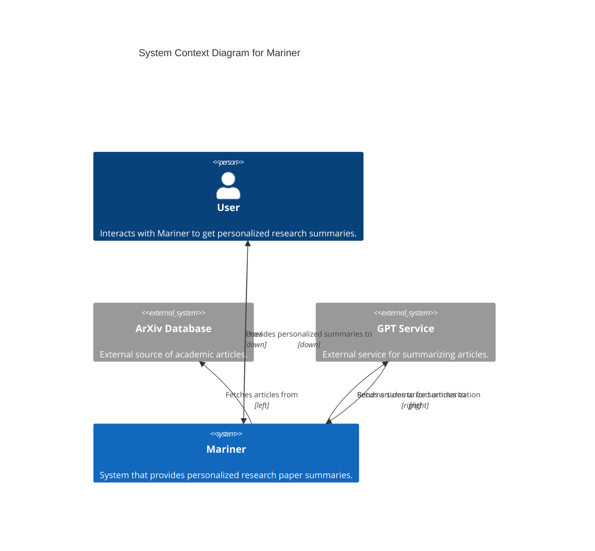
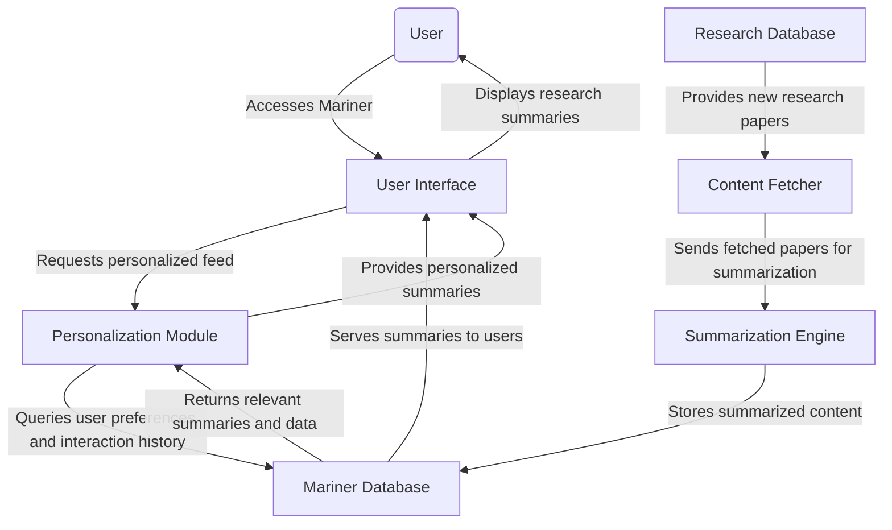
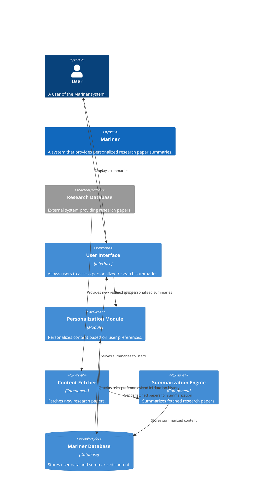
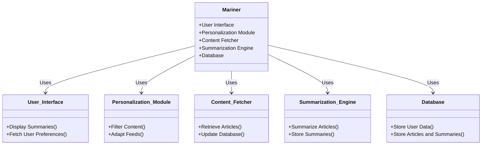
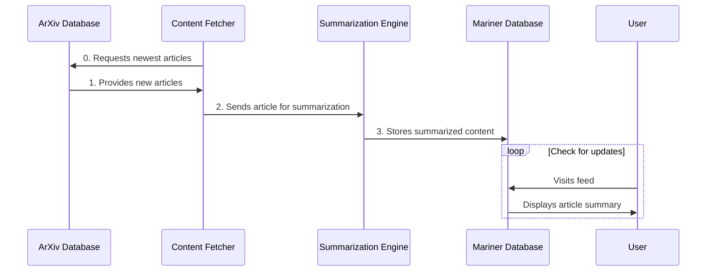

# Mariner Design Document

## Overview

Mariner is an innovative system designed to navigate the vast ocean of academic research and intellectual currents. By leveraging advanced data processing and machine learning techniques, Mariner aims to curate, summarize, and present the most relevant and impactful research findings across a multitude of disciplines. This system acts as a bridge between the expansive world of academic research and the targeted needs of its users, providing streamlined access to knowledge and insights.

### Purpose

The purpose of Mariner is to democratize access to the latest research and foster a deeper understanding of emerging trends in technology, science, and society. It seeks to empower users, from industry professionals to academic researchers, with the ability to quickly grasp complex topics and discover interdisciplinary connections that spark innovative ideas and solutions.

### Goals

- **Content Curation**: To automatically fetch and categorize the latest research papers from diverse fields, ensuring a broad yet relevant selection of content.
- **Intelligent Summarization**: To employ natural language processing (NLP) and machine learning (ML) algorithms to generate concise, accurate summaries of research papers, highlighting key findings and implications.
- **Personalization**: To tailor content delivery based on individual user interests and behaviors, ensuring high relevance and engagement.
- **Usability**: To provide a user-friendly interface that simplifies the exploration of academic research, enabling users to efficiently find and digest information.
- **Community Building**: To create a platform that not only informs but also connects users, fostering a community of curious minds and visionary thinkers.

### Scope

Mariner will initially focus on sourcing content from high-impact academic journals and repositories, particularly those covering technology, science, and societal trends. The system will:

- Incorporate a broad range of research areas to ensure a multidisciplinary approach.
- Use robust algorithms to analyze and summarize texts, ensuring relevance and accuracy.
- Feature a dynamic, adaptive user interface that caters to individual preferences and learning goals.

The design and development of Mariner will prioritize scalability and adaptability, allowing for future expansion into additional research domains and integration with other knowledge platforms and tools.

## Architecture

### System Context



TODO: (incorrect markup, but this idea) Directional modifiers like "down", "left", and "right" are used in the Rel commands to guide the arrows’ paths, helping to separate the entities and make the diagram clearer.
By arranging external systems on either side of Mariner (arXiv to the left and GPT Service to the right), the diagram can visually represent the flow of data in a more organized manner.





### Components



### Sequence Diagram



In this sequence:

1. The **ArXiv Database** provides a new article to the **Content Fetcher**.
2. The **Content Fetcher** sends the article to the **Summarization Engine** for processing.
3. The **Summarization Engine** creates a summary of the article and stores it in the **Mariner Database**.
4. The **User** visits their feed, which triggers the **Mariner Database** to display the latest article summary.

```mermaid
sequenceDiagram
    participant User as User
    participant UI as User Interface
    participant Personalizer as Personalization Module
    participant Fetcher as Content Fetcher
    participant Summarizer as Summarization Engine
    participant DB as Database
    participant ArXiv as ArXiv Database
    participant GPT as External GPT Service

    note right of ArXiv: External System
    note right of GPT: External Service

    User->>+UI: Access Mariner
    UI->>+Personalizer: Request Content
    Personalizer->>+DB: Fetch User Preferences
    DB-->>-Personalizer: User Data

    loop Fetch and Summarize Articles
        Fetcher->>+ArXiv: Query for new articles
        ArXiv-->>-Fetcher: Return articles
        Fetcher->>DB: Store new articles

        Summarizer->>DB: Check for unsummarized articles
        DB-->>Summarizer: Unsummarized articles
        Summarizer->>+GPT: Send articles for summarization
        GPT-->>-Summarizer: Return summaries
        Summarizer->>DB: Store summaries
    end

    Personalizer->>DB: Retrieve personalized summaries
    DB-->>-Personalizer: Summarized Content
    Personalizer-->>-UI: Personalized Summaries
    UI-->>-User: Display Summaries
```

1. **User Accesses Mariner**: The user initiates the process by accessing the Mariner User Interface (UI).
2. **UI Requests Content**: The UI requests personalized content for the user from the Personalization Module.

3. **Personalization Module Fetches User Preferences**: The Personalization Module queries the Mariner Database to fetch the user's preferences and interaction history.

4. **Database Returns User Data**: The Mariner Database returns the relevant user data to the Personalization Module.

5. **Content Fetcher Queries ArXiv for New Articles**: Periodically, the Content Fetcher queries the ArXiv Database to check for new research articles.

6. **ArXiv Returns Articles**: The ArXiv Database provides the latest articles to the Content Fetcher.

7. **Fetcher Stores New Articles in Database**: The Content Fetcher stores the new articles in the Mariner Database for later processing.

8. **Summarization Engine Checks for Unsummarized Articles**: The Summarization Engine queries the Mariner Database to identify articles that have not yet been summarized.

9. **Database Provides Unsummarized Articles**: The Mariner Database returns the list of unsummarized articles to the Summarization Engine.

10. **Summarization Engine Sends Articles to External GPT Service**: The Summarization Engine sends these articles to an External GPT Service for summarization.

11. **GPT Service Returns Summaries**: The External GPT Service processes the articles and returns their summaries to the Summarization Engine.

12. **Summarizer Stores Summaries in Database**: The Summarization Engine stores the generated summaries in the Mariner Database.

13. **Personalization Module Retrieves Personalized Summaries**: The Personalization Module then retrieves personalized summaries based on the user's preferences and history from the Mariner Database.

14. **Database Provides Summarized Content**: The Mariner Database sends the personalized summaries back to the Personalization Module.

15. **Personalization Module Provides Summaries to UI**: The Personalization Module sends these summaries to the User Interface.

16. **UI Displays Summaries to User**: Finally, the User Interface displays the research summaries to the user, completing the process.
