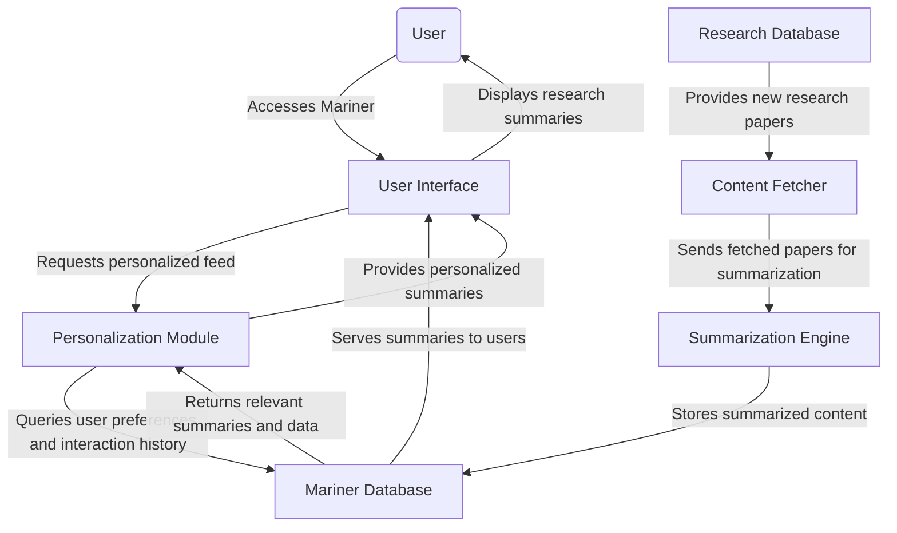
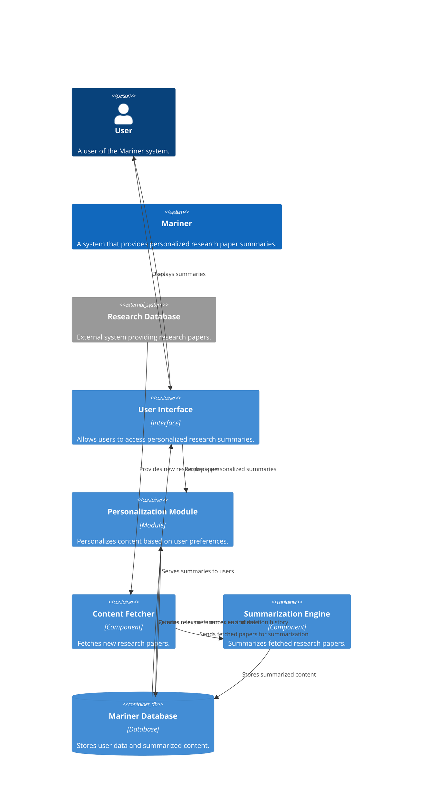
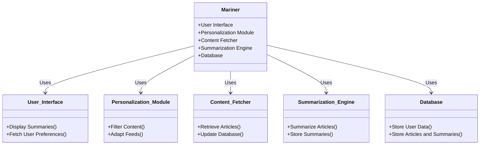
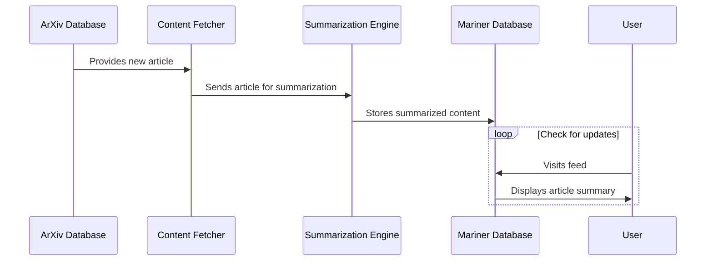

# Mariner Design Document

## Overview

Mariner is an innovative system designed to navigate the vast ocean of academic research and intellectual currents. By leveraging advanced data processing and machine learning techniques, Mariner aims to curate, summarize, and present the most relevant and impactful research findings across a multitude of disciplines. This system acts as a bridge between the expansive world of academic research and the targeted needs of its users, providing streamlined access to knowledge and insights.

### Purpose

The purpose of Mariner is to democratize access to the latest research and foster a deeper understanding of emerging trends in technology, science, and society. It seeks to empower users, from industry professionals to academic researchers, with the ability to quickly grasp complex topics and discover interdisciplinary connections that spark innovative ideas and solutions.

### Goals

- **Content Curation**: To automatically fetch and categorize the latest research papers from diverse fields, ensuring a broad yet relevant selection of content.
- **Intelligent Summarization**: To employ natural language processing (NLP) and machine learning (ML) algorithms to generate concise, accurate summaries of research papers, highlighting key findings and implications.
- **Personalization**: To tailor content delivery based on individual user interests and behaviors, ensuring high relevance and engagement.
- **Usability**: To provide a user-friendly interface that simplifies the exploration of academic research, enabling users to efficiently find and digest information.
- **Community Building**: To create a platform that not only informs but also connects users, fostering a community of curious minds and visionary thinkers.

### Scope

Mariner will initially focus on sourcing content from high-impact academic journals and repositories, particularly those covering technology, science, and societal trends. The system will:

- Incorporate a broad range of research areas to ensure a multidisciplinary approach.
- Use robust algorithms to analyze and summarize texts, ensuring relevance and accuracy.
- Feature a dynamic, adaptive user interface that caters to individual preferences and learning goals.

The design and development of Mariner will prioritize scalability and adaptability, allowing for future expansion into additional research domains and integration with other knowledge platforms and tools.

## Architecture

### System Context

### Components

### Sequence Diagram

In this sequence:

1. The **ArXiv Database** provides a new article to the **Content Fetcher**.
2. The **Content Fetcher** sends the article to the **Summarization Engine** for processing.
3. The **Summarization Engine** creates a summary of the article and stores it in the **Mariner Database**.
4. The **User** visits their feed, which triggers the **Mariner Database** to display the latest article summary.
